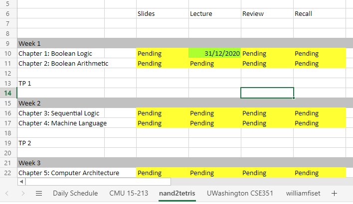
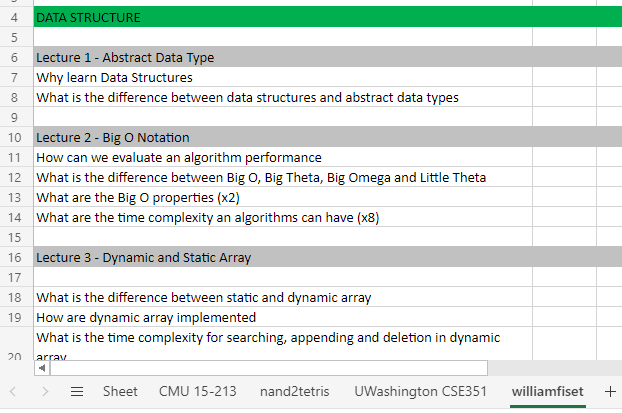
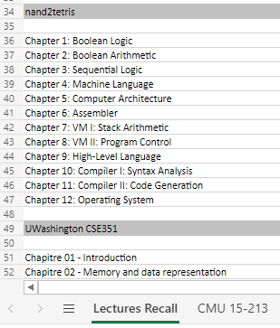
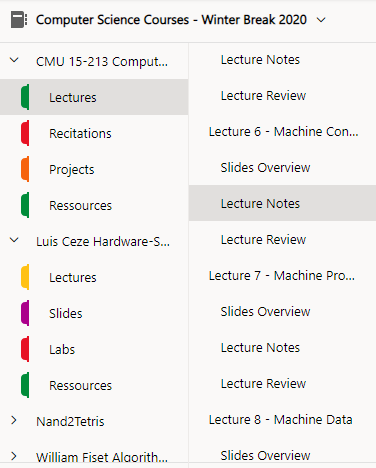

# Schedule-Automation

A script that automate my learning workflow by generating spreadsheet from
a list of courses and lectures

## Table of Contents

* [Prerequisites](#prerequisites)
* [Features](#features)
* [Usage](#usage)
* [Links](#links)
	* [Using the Schedule Spreadsheet to schedule tasks]
	* [Using the Active Recall Spreasheet to retain information]
	* [Using the spreadsheet to make weekly-daily todos]
	* [Using the Time Blocking Spreadsheet with Pomodoro]
* [Implementation](#implementation)
* [Ressources](#ressources)

## Prerequisites

1. Clone the repository

`` git clone https://github.com/yukikongju/Schedule-Automation ``

2. Install the required dependencies

`` pip install -r requirements.txt ``

## Features

### Generate Spreadsheets needed for semester

Status: incomplete

From a directory containing text files with lectures for each course for
a given semester, generate:

- [x] Schedule Spreadsheet: Generate a spreadsheet where each tab is the course
	  content separated by week
- [x] Active Recall Spreadsheet: Generate a Header for each lectures/chapter
- [ ] Practice Spreadsheet: Generate a Header for all TPs
- [ ] OneNote Document: Generate a OneNote Document where all courses is
	  a section, and where the lectures contains the following subsections:
	  - Slides Overview
	  - Lecture Notes
	  - Lecture Review

Schedule Spreadsheet Screenshot:

Active Recall Spreadsheet Screenshot:

OneNote Document Screenshot:

Pratique Spreadsheet:
[todo]

### Generate Time Blocking Spreadsheet

Status: Complete

A time table with 15 minutes increments to monitor your daily tasks

### Generate a Weekly-Daily Spreadsheet

Status: uncertain

## Usage

[to do]

## Implementation

%% - [ ] Time Tracker: script that create a new file each month
%% - [ ] Schedule: given the the lecture and project list, produce a spreadsheet
%%       that indicates the course material that needs to be done for a given
%%       week.
%% - [ ] Weekly-Daily Plan: [to do]

## Modules

* openpyxl: excel module
* streamlit: view weekly-monthly stats
* selenium: create a bot

## Ressources

- [ ] How to Automate tasks on windows: https://www.techradar.com/news/software/applications/how-to-automate-tasks-in-windows-1107254
- [ ] openpyxl documentation: https://openpyxl.readthedocs.io/en/stable/tutorial.html
